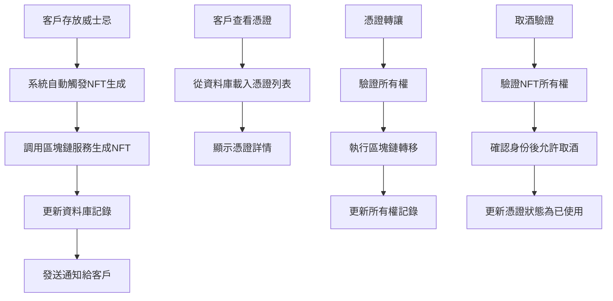

# 設計文件 - 威士忌NFT憑證系統

## 概述

威士忌NFT憑證系統是一個整合到現有CaskChain平台的簡化數位憑證解決方案。系統會在客戶存放威士忌時自動生成NFT憑證，提供查看、轉讓和驗證功能。設計重點在於簡單易用，最少化用戶操作步驟，同時保持區塊鏈技術的安全性和透明度。

## 技術標準整合

### 現有技術棧運用
- **前端框架**: 基於現有React 18 + TypeScript + Vite架構
- **狀態管理**: 擴展現有Zustand stores，新增NFT憑證相關狀態
- **區塊鏈整合**: 運用現有ethers.js和錢包連接基礎設施
- **API結構**: 擴展現有axios-based API客戶端
- **UI組件**: 使用現有TailwindCSS + Framer Motion設計系統

### 專案結構遵循
- **檔案組織**: 遵循現有src/目錄結構
- **元件命名**: 延續現有元件命名慣例
- **類型定義**: 擴展src/types/index.ts中的現有介面

## 程式碼重用分析

### 現有組件運用
- **WhiskeyItem介面**: 擴展現有威士忌資料模型以包含NFT資訊
- **區塊鏈服務**: 擴展src/services/blockchain.ts的現有NFT功能
- **API服務**: 擴展src/services/api.ts的現有NFT API
- **狀態管理**: 擴展src/store/index.ts的現有NFT store

### 整合接點
- **威士忌存放流程**: 與現有Upload.tsx頁面整合
- **用戶認證**: 使用現有authApi和useAuthStore
- **錢包連接**: 使用現有useBlockchain hook
- **通知系統**: 使用現有react-hot-toast系統

## 架構設計



## 元件與介面

### NFTCertificate元件
- **目的**: 顯示單一NFT憑證的詳細資訊
- **介面**: 
  - `certificate: NFTCertificate`
  - `onTransfer: (tokenId: string, to: string) => void`
  - `onRedeem: (tokenId: string) => void`
- **依賴**: useBlockchain, useNFTStore
- **重用**: 現有的威士忌詳情顯示邏輯和樣式

### CertificateList元件  
- **目的**: 顯示用戶所有憑證的清單
- **介面**:
  - `certificates: NFTCertificate[]`
  - `loading: boolean`
  - `onCertificateClick: (certificate: NFTCertificate) => void`
- **依賴**: useNFTStore, useAuthStore
- **重用**: 現有的威士忌清單元件樣式和分頁邏輯

### TransferModal元件
- **目的**: 處理憑證轉讓的模態對話框
- **介面**:
  - `certificate: NFTCertificate`
  - `isOpen: boolean`
  - `onClose: () => void`
  - `onTransfer: (toAddress: string) => void`
- **依賴**: useBlockchain
- **重用**: 現有的模態對話框樣式和驗證邏輯

### VerificationTool元件
- **目的**: 提供憑證驗證查詢功能
- **介面**:
  - `onVerify: (tokenId: string) => void`
- **依賴**: nftApi
- **重用**: 現有的搜尋和驗證UI元素

## 資料模型

### 擴展現有NFTCertificate介面
```typescript
// 擴展src/types/index.ts中的現有介面
export interface NFTCertificate {
  tokenId: string
  contractAddress: string
  whiskeyId: string
  owner: string
  status: 'pending' | 'active' | 'redeemed' | 'transferred'
  metadata: {
    name: string
    description: string
    image: string
    attributes: Array<{
      trait_type: string
      value: string | number
    }>
    // 憑證特定屬性
    certificate_type: 'whiskey_storage'
    storage_location: string
    deposit_date: string
    redemption_instructions: string
    whiskey_details: {
      brand: string
      age: number
      region: string
      category: string
    }
  }
  transactionHash: string
  createdAt: Date
  redeemedAt?: Date
  transferHistory: Array<{
    from: string
    to: string
    transactionHash: string
    timestamp: Date
    blockNumber: number
  }>
  // 自動重試機制支援
  generationRetries: number
  lastRetryAt?: Date
  failureReason?: string
}
```

### 新增CertificateService資料模型
```typescript
export interface CertificateService {
  // 自動生成憑證（需求1）
  generateCertificateForWhiskey: (
    whiskeyId: string, 
    ownerAddress: string, 
    retryCount?: number
  ) => Promise<NFTCertificate>
  
  // 憑證管理（需求2）
  getCertificatesByOwner: (ownerAddress: string) => Promise<NFTCertificate[]>
  getCertificateById: (tokenId: string) => Promise<NFTCertificate | null>
  
  // 轉讓功能（需求3）
  transferCertificate: (
    tokenId: string, 
    fromAddress: string,
    toAddress: string
  ) => Promise<{ success: boolean, transactionHash?: string, error?: string }>
  
  // 取酒驗證（需求4）
  redeemCertificate: (
    tokenId: string, 
    redeemer: string
  ) => Promise<{ success: boolean, certificate?: NFTCertificate, error?: string }>
  
  // 憑證驗證（需求5）
  verifyCertificate: (tokenId: string) => Promise<{
    valid: boolean
    certificate?: NFTCertificate
    blockchainVerified: boolean
    error?: string
  }>
  
  // 自動重試支援
  retryFailedGeneration: (whiskeyId: string) => Promise<NFTCertificate>
  getFailedGenerations: () => Promise<Array<{whiskeyId: string, retries: number, lastError: string}>>
}
```

### 擴展WhiskeyItem介面
```typescript
// 擴展現有WhiskeyItem以支援NFT憑證整合
export interface WhiskeyItem {
  // 現有屬性保持不變
  id: string
  name: string
  brand: string
  age: number
  vintage?: number
  region: string
  alcoholContent: number
  volume: number
  category: 'Single Malt' | 'Blended' | 'Bourbon' | 'Rye' | 'Irish' | 'Japanese'
  description: string
  images: string[]
  depositDate: Date
  owner: {
    name: string
    email: string
    phone: string
  }
  storageLocation: {
    zone: string
    rack: string
    position: string
  }
  condition: 'Excellent' | 'Good' | 'Fair'
  estimatedValue: number
  createdAt: Date
  updatedAt: Date
  
  // 新增NFT憑證相關屬性
  nftCertificate?: {
    tokenId: string
    contractAddress: string
    status: 'generating' | 'active' | 'redeemed' | 'transfer_pending'
    generationProgress: {
      stage: 'pending' | 'minting' | 'uploading_metadata' | 'complete' | 'failed'
      retryCount: number
      lastError?: string
    }
  }
  // 更新現有屬性
  status: 'stored' | 'pending_nft' | 'nft_generated' | 'nft_failed' | 'retrieved'
}
```

## API設計與現有系統整合

### 擴展現有API服務 (src/services/api.ts)

```typescript
// 擴展現有nftApi
export const nftApi = {
  // 現有方法保持不變
  getByWhiskeyId: async (whiskeyId: string) => {...},
  generate: async (whiskeyId: string) => {...},
  getMetadata: async (tokenId: string) => {...},
  verifyOwnership: async (tokenId: string, ownerAddress: string) => {...},
  
  // 新增憑證系統API
  
  // 需求1: 自動生成憑證
  generateCertificate: async (whiskeyId: string, ownerAddress: string) => {
    const response = await api.post<{ data: NFTCertificate }>(`/nft/certificate/generate`, {
      whiskeyId,
      ownerAddress,
      autoRetry: true,
      maxRetries: 3
    })
    return response.data.data
  },
  
  // 需求2: 憑證查看與管理  
  getCertificatesByOwner: async (ownerAddress: string) => {
    const response = await api.get<{ data: NFTCertificate[] }>(`/nft/certificates/owner/${ownerAddress}`)
    return response.data.data
  },
  
  getCertificateById: async (tokenId: string) => {
    const response = await api.get<{ data: NFTCertificate }>(`/nft/certificate/${tokenId}`)
    return response.data.data
  },
  
  // 需求3: 憑證轉讓
  transferCertificate: async (tokenId: string, toAddress: string) => {
    const response = await api.post<{ data: { success: boolean, transactionHash?: string } }>(
      `/nft/certificate/${tokenId}/transfer`, 
      { toAddress }
    )
    return response.data.data
  },
  
  // 需求4: 取酒驗證
  redeemCertificate: async (tokenId: string) => {
    const response = await api.post<{ data: { success: boolean, certificate: NFTCertificate } }>(
      `/nft/certificate/${tokenId}/redeem`
    )
    return response.data.data
  },
  
  // 需求5: 憑證驗證
  verifyCertificate: async (tokenId: string) => {
    const response = await api.get<{ 
      data: { 
        valid: boolean, 
        certificate?: NFTCertificate, 
        blockchainVerified: boolean 
      } 
    }>(`/nft/certificate/${tokenId}/verify`)
    return response.data.data
  },
  
  // 管理員功能
  getFailedGenerations: async () => {
    const response = await api.get<{ data: Array<{whiskeyId: string, retries: number, lastError: string}> }>(
      '/admin/nft/failed-generations'
    )
    return response.data.data
  },
  
  retryGeneration: async (whiskeyId: string) => {
    const response = await api.post<{ data: NFTCertificate }>(`/admin/nft/retry-generation/${whiskeyId}`)
    return response.data.data
  }
}
```

### 擴展區塊鏈服務 (src/services/blockchain.ts)

```typescript
// 在現有BlockchainService類別中新增方法
class BlockchainService {
  // 現有方法保持不變...
  
  // 新增憑證生成方法（支援自動重試）
  async mintCertificateNFT(
    whiskeyId: string, 
    ownerAddress: string, 
    metadata: any,
    retryCount: number = 0
  ): Promise<string | null> {
    try {
      const metadataURI = await this.uploadToIPFS(metadata)
      const tx = await this.contract.mintWhiskeyNFT(ownerAddress, metadataURI)
      const receipt = await tx.wait()
      
      return JSON.stringify({
        tokenId: this.extractTokenId(receipt),
        transactionHash: receipt.hash,
        blockNumber: receipt.blockNumber
      })
    } catch (error: any) {
      if (retryCount < 3) {
        await new Promise(resolve => setTimeout(resolve, 2000 * (retryCount + 1))) // 指數退避
        return this.mintCertificateNFT(whiskeyId, ownerAddress, metadata, retryCount + 1)
      }
      
      console.error(`Certificate generation failed after ${retryCount} retries:`, error)
      throw error
    }
  }
  
  // 憑證轉讓方法
  async transferCertificate(tokenId: string, fromAddress: string, toAddress: string): Promise<boolean> {
    try {
      const tx = await this.contract.transferFrom(fromAddress, toAddress, tokenId)
      await tx.wait()
      return true
    } catch (error) {
      console.error('Certificate transfer error:', error)
      return false
    }
  }
  
  // 憑證驗證方法
  async verifyCertificateOwnership(tokenId: string, expectedOwner: string): Promise<boolean> {
    try {
      const actualOwner = await this.contract.ownerOf(tokenId)
      return actualOwner.toLowerCase() === expectedOwner.toLowerCase()
    } catch (error) {
      console.error('Certificate verification error:', error)
      return false
    }
  }
  
  private extractTokenId(receipt: any): string {
    const transferEvent = receipt.logs.find(
      (log: any) => log.fragment && log.fragment.name === 'Transfer'
    )
    return transferEvent?.args?.[2]?.toString() || '0'
  }
}
```

### 狀態管理整合 (src/store/index.ts)

```typescript
// 擴展現有useNFTStore
export const useNFTStore = create<NFTState>((set, get) => ({
  // 現有狀態保持不變...
  certificates: [] as NFTCertificate[],
  certificateLoading: false,
  generationProgress: new Map<string, {stage: string, retryCount: number}>(),
  
  // 新增憑證相關方法
  
  // 需求1: 自動生成支援
  setCertificateGenerationProgress: (whiskeyId: string, progress: {stage: string, retryCount: number}) => {
    const currentProgress = get().generationProgress
    currentProgress.set(whiskeyId, progress)
    set({ generationProgress: new Map(currentProgress) })
  },
  
  // 需求2: 憑證管理
  setCertificates: (certificates: NFTCertificate[]) => set({ certificates }),
  
  addCertificate: (certificate: NFTCertificate) => {
    const certificates = get().certificates
    set({ certificates: [certificate, ...certificates] })
  },
  
  updateCertificate: (tokenId: string, updates: Partial<NFTCertificate>) => {
    const certificates = get().certificates
    const updatedCertificates = certificates.map(cert => 
      cert.tokenId === tokenId ? { ...cert, ...updates } : cert
    )
    set({ certificates: updatedCertificates })
  },
  
  // 需求3: 轉讓狀態管理
  setCertificateTransferring: (tokenId: string, transferring: boolean) => {
    const certificates = get().certificates
    const updatedCertificates = certificates.map(cert => 
      cert.tokenId === tokenId ? { 
        ...cert, 
        status: transferring ? 'transferred' : cert.status 
      } : cert
    )
    set({ certificates: updatedCertificates })
  },
  
  // 需求4: 取酒狀態管理
  markCertificateRedeemed: (tokenId: string) => {
    const certificates = get().certificates
    const updatedCertificates = certificates.map(cert => 
      cert.tokenId === tokenId ? { 
        ...cert, 
        status: 'redeemed',
        redeemedAt: new Date()
      } : cert
    )
    set({ certificates: updatedCertificates })
  },
  
  setCertificateLoading: (loading: boolean) => set({ certificateLoading: loading })
}))
```

### 現有頁面整合計劃

#### Upload.tsx 整合
```typescript
// 在現有上傳成功後觸發NFT生成
const handleUploadSuccess = async (whiskeyId: string) => {
  // 現有邏輯...
  
  // 新增: 自動觸發NFT憑證生成
  try {
    const userAddress = await blockchainService.getWalletAddress()
    if (userAddress) {
      // 設置生成進度
      useNFTStore.getState().setCertificateGenerationProgress(whiskeyId, {
        stage: 'pending',
        retryCount: 0
      })
      
      // 觸發憑證生成
      await nftApi.generateCertificate(whiskeyId, userAddress)
      
      toast.success('威士忌已存放，NFT憑證正在生成中...')
    }
  } catch (error) {
    console.error('Certificate generation failed:', error)
    toast.error('NFT憑證生成失敗，將自動重試')
  }
}
```

#### 新增 Certificates.tsx 頁面
```typescript
// src/pages/Certificates.tsx - 全新頁面
import React, { useEffect, useState } from 'react'
import { useAuthStore } from '@/store'
import { useNFTStore } from '@/store'
import { nftApi } from '@/services/api'
import { CertificateList } from '@/components/nft/CertificateList'
import { TransferModal } from '@/components/nft/TransferModal'

export const Certificates: React.FC = () => {
  const { user } = useAuthStore()
  const { certificates, certificateLoading, setCertificates, setCertificateLoading } = useNFTStore()
  const [selectedCertificate, setSelectedCertificate] = useState<NFTCertificate | null>(null)
  const [transferModalOpen, setTransferModalOpen] = useState(false)
  
  useEffect(() => {
    loadCertificates()
  }, [user])
  
  const loadCertificates = async () => {
    if (!user) return
    
    setCertificateLoading(true)
    try {
      const userCertificates = await nftApi.getCertificatesByOwner(user.walletAddress)
      setCertificates(userCertificates)
    } catch (error) {
      console.error('Failed to load certificates:', error)
    } finally {
      setCertificateLoading(false)
    }
  }
  
  const handleTransfer = async (toAddress: string) => {
    if (!selectedCertificate) return
    
    try {
      await nftApi.transferCertificate(selectedCertificate.tokenId, toAddress)
      toast.success('憑證轉讓成功')
      loadCertificates() // 重新載入
    } catch (error) {
      toast.error('憑證轉讓失敗')
    } finally {
      setTransferModalOpen(false)
    }
  }
  
  return (
    <div className="container mx-auto p-6">
      <h1 className="text-2xl font-bold mb-6">我的威士忌憑證</h1>
      <CertificateList 
        certificates={certificates}
        loading={certificateLoading}
        onCertificateClick={setSelectedCertificate}
        onTransferClick={() => setTransferModalOpen(true)}
      />
      
      <TransferModal 
        certificate={selectedCertificate}
        isOpen={transferModalOpen}
        onClose={() => setTransferModalOpen(false)}
        onTransfer={handleTransfer}
      />
    </div>
  )
}
```

## 錯誤處理

### 詳細錯誤場景與處理策略

#### 1. NFT生成失敗 (需求1)
```typescript
// 自動重試機制實作
class CertificateGenerationError extends Error {
  constructor(
    public whiskeyId: string,
    public retryCount: number,
    public originalError: any,
    message: string
  ) {
    super(message)
    this.name = 'CertificateGenerationError'
  }
}

// 處理策略
const handleGenerationFailure = async (whiskeyId: string, error: any, retryCount: number) => {
  // 指數退避重試 (2s, 4s, 8s)
  if (retryCount < 3) {
    const delay = 2000 * Math.pow(2, retryCount)
    await new Promise(resolve => setTimeout(resolve, delay))
    
    // 更新生成進度
    useNFTStore.getState().setCertificateGenerationProgress(whiskeyId, {
      stage: `retry_${retryCount + 1}`,
      retryCount: retryCount + 1
    })
    
    return blockchainService.mintCertificateNFT(whiskeyId, ownerAddress, metadata, retryCount + 1)
  }
  
  // 最終失敗處理
  await api.post('/admin/nft/generation-failure', {
    whiskeyId,
    retryCount,
    error: error.message,
    timestamp: new Date().toISOString()
  })
  
  // 用戶通知
  useUIStore.getState().addNotification({
    type: 'error',
    title: 'NFT憑證生成失敗',
    message: '系統將自動重試，或聯繫客服協助處理'
  })
}
```

#### 2. 區塊鏈網路連接失敗
```typescript
// 網路回復機制
class NetworkManager {
  private fallbackRPCs = [
    'https://polygon-rpc.com',
    'https://rpc-mainnet.matic.network',
    'https://matic-mainnet.chainstacklabs.com'
  ]
  
  async handleNetworkFailure(originalRPC: string) {
    // 嘗試備用RPC
    for (const fallbackRPC of this.fallbackRPCs) {
      try {
        await this.switchToRPC(fallbackRPC)
        toast.success('已切換到備用網路節點')
        return true
      } catch (error) {
        console.warn(`Fallback RPC ${fallbackRPC} failed:`, error)
      }
    }
    
    // 所有RPC都失敗，進入離線模式
    useUIStore.getState().addNotification({
      type: 'warning',
      title: '區塊鏈網路暫時無法連接',
      message: '憑證查看功能正常，轉讓功能暫時不可用'
    })
    
    return false
  }
}
```

#### 3. 錢包連接問題
```typescript
// 錢包連接錯誤處理
const handleWalletError = (error: any) => {
  switch (error.code) {
    case 4001: // User rejected
      toast.error('請連接錢包以使用NFT憑證功能')
      break
    case -32002: // Already pending
      toast.warning('錢包連接請求進行中，請檢查錢包')
      break
    case -32603: // Internal error
      toast.error('錢包連接失敗，請重新整理頁面')
      break
    default:
      toast.error('錢包連接出現問題，請檢查錢包設定')
  }
}
```

#### 4. 憑證轉讓失敗 (需求3)
```typescript
// 轉讓前驗證
const validateTransfer = async (tokenId: string, toAddress: string) => {
  // 地址格式驗證
  if (!ethers.isAddress(toAddress)) {
    throw new Error('請輸入有效的錢包地址')
  }
  
  // 所有權驗證
  const isOwner = await blockchainService.verifyCertificateOwnership(tokenId, currentUser.walletAddress)
  if (!isOwner) {
    throw new Error('您不是此憑證的擁有者')
  }
  
  // Gas費用估算
  const gasEstimate = await blockchainService.estimateTransferGas(tokenId, toAddress)
  const balance = await blockchainService.getWalletBalance()
  
  if (balance < gasEstimate) {
    throw new Error(`錢包餘額不足，需要至少 ${gasEstimate} ETH 支付交易費用`)
  }
}
```

#### 5. 取酒驗證失敗 (需求4)
```typescript
const handleRedemptionError = (error: any, tokenId: string) => {
  if (error.message.includes('Certificate already redeemed')) {
    toast.error('此憑證已被使用，無法重複取酒')
  } else if (error.message.includes('Not certificate owner')) {
    toast.error('只有憑證擁有者才能取酒')
  } else if (error.message.includes('Certificate not found')) {
    toast.error('找不到指定的憑證')
  } else {
    toast.error('取酒驗證失敗，請聯繫客服')
    console.error('Redemption error:', error)
  }
}
```

## 效能優化策略

### 30秒生成目標達成計劃

#### 1. 並行處理架構
```typescript
// 憑證生成流程優化
class OptimizedCertificateGenerator {
  async generateCertificate(whiskeyId: string, ownerAddress: string) {
    const startTime = Date.now()
    
    // 並行執行: 元資料準備 + 智能合約準備
    const [metadata, contractReady] = await Promise.all([
      this.prepareMetadata(whiskeyId),
      this.ensureContractReady()
    ])
    
    // IPFS上傳 (3-5秒)
    const metadataURI = await this.uploadToIPFS(metadata)
    
    // 智能合約鑄造 (10-15秒)
    const mintResult = await this.mintNFT(ownerAddress, metadataURI)
    
    // 資料庫更新 (1-2秒)
    await this.updateDatabase(whiskeyId, mintResult)
    
    const totalTime = Date.now() - startTime
    console.log(`Certificate generation completed in ${totalTime}ms`)
    
    return mintResult
  }
}
```

#### 2. 預先準備策略
```typescript
// 威士忌存放時預先準備元資料
const prepareForNFTGeneration = async (whiskeyData: WhiskeyItem) => {
  // 在背景預先處理圖片和元資料
  const optimizedMetadata = {
    name: `${whiskeyData.brand} ${whiskeyData.name} - CaskChain證書 #${whiskeyData.id}`,
    description: `存放於CaskChain的威士忌數位憑證`,
    image: await this.optimizeImage(whiskeyData.images[0]),
    attributes: this.generateAttributes(whiskeyData),
    certificate_type: 'whiskey_storage',
    storage_location: `${whiskeyData.storageLocation.zone}-${whiskeyData.storageLocation.rack}-${whiskeyData.storageLocation.position}`,
    deposit_date: whiskeyData.depositDate.toISOString(),
    redemption_instructions: '請攜帶此NFT憑證至CaskChain倉庫提取威士忌',
    whiskey_details: {
      brand: whiskeyData.brand,
      age: whiskeyData.age,
      region: whiskeyData.region,
      category: whiskeyData.category
    }
  }
  
  // 快取準備好的元資料
  await this.cacheMetadata(whiskeyData.id, optimizedMetadata)
}
```

#### 3. 批次處理機制
```typescript
// 處理大量並發生成請求
class BatchCertificateProcessor {
  private queue: Array<{whiskeyId: string, ownerAddress: string, resolve: Function, reject: Function}> = []
  private processing = false
  
  async addToQueue(whiskeyId: string, ownerAddress: string): Promise<NFTCertificate> {
    return new Promise((resolve, reject) => {
      this.queue.push({whiskeyId, ownerAddress, resolve, reject})
      this.processQueue()
    })
  }
  
  private async processQueue() {
    if (this.processing) return
    this.processing = true
    
    while (this.queue.length > 0) {
      // 每批處理5個請求
      const batch = this.queue.splice(0, 5)
      
      try {
        const results = await Promise.allSettled(
          batch.map(item => this.generateSingleCertificate(item.whiskeyId, item.ownerAddress))
        )
        
        // 處理結果
        results.forEach((result, index) => {
          if (result.status === 'fulfilled') {
            batch[index].resolve(result.value)
          } else {
            batch[index].reject(result.reason)
          }
        })
        
      } catch (error) {
        batch.forEach(item => item.reject(error))
      }
      
      // 批次間延遲，避免網路擁塞
      await new Promise(resolve => setTimeout(resolve, 1000))
    }
    
    this.processing = false
  }
}
```

## 測試策略

### 單元測試
- NFT憑證生成邏輯測試
- 憑證驗證功能測試
- 轉讓流程邏輯測試
- 錯誤處理場景測試

### 整合測試
- 威士忌存放到NFT生成的完整流程
- 憑證轉讓的端到端測試
- 取酒驗證流程測試
- 區塊鏈同步測試

### 端對端測試
- 客戶存放威士忌並獲得憑證的完整用戶旅程
- 憑證轉讓和接收的雙方流程
- 管理員驗證憑證的操作流程

## 實作優先級

### 第一階段 - 核心憑證功能
- 自動NFT憑證生成
- 基本憑證查看功能
- 簡單的憑證驗證

### 第二階段 - 轉讓功能
- 憑證轉讓介面
- 轉讓歷史記錄
- 所有權驗證

### 第三階段 - 取酒驗證
- 取酒驗證系統
- 憑證狀態管理
- 管理員審核介面

### 第四階段 - 完善功能
- 錯誤恢復機制
- 效能優化
- 使用分析和報告